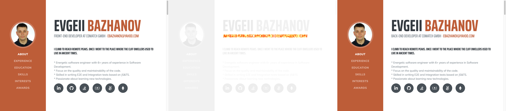

# Cypress visual regression example (screenshot comparison)
> "cypress-image-snapshot": "^3.1.1"

#### CircleCI [](https://circleci.com/gh/Ebazhanov/cypress-visual-regression-example)

This repo an example of how to use visual regression (screenshot comparison) + cypress



#### TODO
- [x] integrate with circle
- [x] add mochawesome html
- [ ] add failed screenshot to mochawesome html
- [ ] play with `Threshold`
```javascript
addMatchImageSnapshotCommand({
  failureThreshold: 0.03, // threshold for entire image
  failureThresholdType: 'percent', // percent of image or number of pixels
  customDiffConfig: { threshold: 0.1 }, // threshold for each pixel
  capture: 'viewport', // capture viewport in screenshot
});
```

### An example of screenshot diff [here in circleci job](https://20-248710227-gh.circle-artifacts.com/0/cypress/snapshots/failed.test.js/__diff_output__/Visual%20regression%20tests%20--%20should.diff.png)


